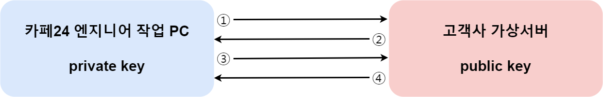

# 기술지원 Key File 등록 방법

## 1. 기술지원 서버 접근 동작 원리

카페24 클라우드는 기술지원을 위해 서버 접속 진행 시, 비밀번호를 입력하지 않고 SSH 인증키를 이용하는 방식을 사용하여 높은 보안성을 제공합니다.

SSH 인증키를 이용하는 방식은 다음과 같습니다.

<div align="left">

<figure><figcaption></figcaption></figure>

</div>

#### a. 카페24 엔지니어

private key를 가지며, 서버 내 기술지원을 위한 원격 접속 허용을 요청하는 대상입니다.


#### b. 고객사 가상서버

public key를 가지며, 서버 원격 접속 요청에 대한 인증 및 접근 허용 진행합니다.


① 카페24 엔지니어 작업 PC에서 고객사 가상서버로 SSH 연결 요청

②  고객사 가상서버에서 무작위로 데이터 문자열을 생성한 후, 카페24 엔지니어 작업 PC로 전송

③ 카페24 엔지니어 작업 PC에서 수신한 데이터를 private key로 암호화하여 고객사 가상서버로 재전송

④ 고객사 가상서버에서 수신한 암호화된 데이터를 public key로 복호화하여 데이터 비교 후, 인증을 진행


## 2. 기술지원 서버 접속 허용 방법

기술지원을 받고자 하는 대상 서버에 원격 접속 허용 작업이 진행되어야 원활한 기술지원이 가능합니다.

### (1) 방화벽 INBOUND 규칙 설정

기술지원 대상 서버로 접속할 수 있도록 SSH 접속 허용 IP를 추가합니다.

① [<mark style="color:blue;">클라우드 콘솔</mark>](https://console.cafe24.com/login) 접속 및 로그인

② 보안 서비스 > 방화벽 순으로 메뉴 접속

③ 기술지원 받을 서버와 연결된 방화벽 선택

④ 상세 정보에서 보안정책 설정의 \[설정] 버튼 클릭

⑤ 보안 정책 설정 (INBOUND) 옆 \[추가] 버튼 클릭

⑥ 아래의 규칙 추가 후, \[확인] 버튼 클릭

| 서비스 | 프로토콜 | 포트범위 |   원격지 IP/CIDR  |
| :-: | :--: | :--: | :------------: |
| SSH |  tcp |  22  | 203.245.13.207 |


### (2) root 권한 획득

접근 허용 스크립트 실행을 위해 root 권한이 필요합니다.

따라서 OS별 기본 제공되는 초기 계정으로 SSH 접속하여 아래의 명령어를 통해 root 권한을 획득합니다.

가상서버 접속 방법은 [<mark style="color:blue;">\[SSH 키페어 접속 방법\]</mark>](../../server/server/connect/keypair.md)을 참고해 주세요.

```shell-session
$ sudo -i
```


### (3) 접근 허용 스크립트 실행

root 권한을 획득한 후, 아래의 명령어를 통해 접근 허용 스크립트를 실행합니다.

고객사 가상서버 접속을 위한 일반 계정 생성 및 public key 파일이 자동으로 생성됩니다.

```shell-session
$ curl -sLf https://cloud-tech.cafe24.com | sh -
```

<mark style="color:red;">기술지원 완료 후, 아래의 삭제 명령어를 실행합니다.</mark>

생성된 계정 및 public key 파일을 자동으로 삭제되며, 서버로 SSH 접속이 불가능해 집니다.

```shell-session
$ curl -sLf https://cloud-tech.cafe24.com | CAFE24DEL=yes sh –
```
