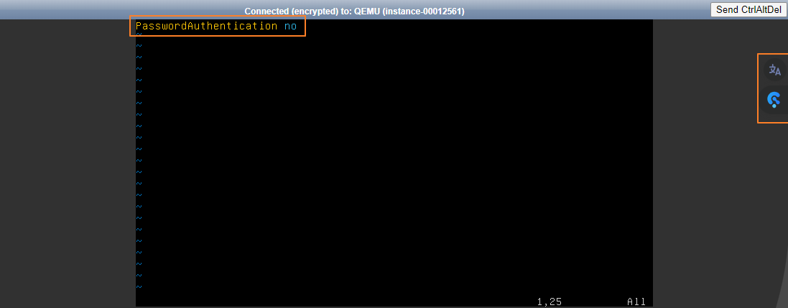

# FTP 구성 방법

## 1. FTP란 무엇인가요?

FTP(File Transfer Protocol)는 인터넷으로 연결된 클라이언트와 서버 사이의 파일 전송을 위한 프로토콜입니다.

하지만 데이터를 평문으로 전송하여 보안이 취약하다는 단점이 있습니다.

따라서 카페24클라우드는 보안이 강화된 <mark style="color:blue;">**SFTP(Secure File Transfer Protocol)**</mark>의 사용을 권장합니다.

SFTP 사용 방법은 [SFTP 접속은 어떻게 할 수 있나요?](sftp.md) 를 참고해 주세요.

본 매뉴얼에서는 FTP Passive mode 설정하는 방법을 설명합니다.

&#x20;

FTP에는 FTP 서버와 FTP 클라이언트가 통신하는 방법에 따라 Passive 모드와 Active 모드가 있습니다.

FTP 서버와 클라이언트는 각각 두 개의 포트를 사용하여 통신 합니다.

* Command port: 두 서버 간의 연결을 제어
* Data port : 두 서버 간의 데이터 전송

&#x20;

### (1) Passive mode

데이터 전송 요청을 클라이언트가 서버에게 하는 방식입니다.

클라이언트 방화벽의 영향을 받는 Active mode의 단점을 보완합니다.

Passive mode의 통신 방법은 다음과 같습니다.


① 클라이언트에서 서버의 21번 포트로 접속

② 서버에서 클라이언트의 요청에 응답(ack) 하며 클라이언트가 접속할 자신의 Data port 전달

③ 클라이언트에서 서버의 Data port로 접속 시도

④ 서버가 클라이언트의 요청에 응답(ack)

<figure><figcaption></figcaption></figure>


### (2) Active mode

서버가 클라이언트로 접속 요청을 하는 방식입니다.

FTP 클라이언트가 동작하는 PC/서버에 방화벽 설정이나 공유기가 있어 외부에서 접속이 불가능하면 연결이 이뤄지지 않습니다.

클라이언트가 외부 접속을 허용하지 않을 경우 FTP 로그인은 되지만 데이터 전송 및 파일 리스트를 받지 못하는 문제가 발생합니다.

<mark style="color:blue;">따라서 Active mode의 이러한 단점을 보완하는 Passive mode의 사용을 권장합니다.</mark>

Active mode의 통신 방법은 다음과 같습니다.


① 클라이언트에서 서버의 21 port로 접속하여 자신의 Data port 전달

② 서버에서 클라이언트의 요청에 응답(acks)

③ 서버가 클라이언트의 Data port로 접속 요청

④ 클라이언트가 서버의 요청에 응답(acks)

<figure><figcaption></figcaption></figure>


## 2. FTP Passive mode 설정 및 접속

### (1) FTP 서버의 방화벽 설정

서버의 Data 포트로 사용할 포트 대역을 허용합니다.

방화벽 설정에 대한 자세한 내용은  [가상서버에 방화벽 연결과 설정은 어떻게 하나요?](../../../security/security/config.md) 를 참고해 주세요

① 클라이언트가 서버에 초기 접속을 요청할 Command 포트 21번을 허용합니다.

② 클라이언트가 서버에게 데이터 통신을 요청할 Data 포트를 허용합니다.&#x20;

&#x20;   해당 포트는 49152\~65535 사이의 특정 범주를 택해 개방할 수 있습니다.

<figure><figcaption></figcaption></figure>


### (2) vsftp 패키지 설치 및 실행

FTP 서버로 사용할 가상서버에 vsftpd 패키지를 설치합니다.

```shell-session
# CentOS
$ sudo yum install vsftpd

# Ubuntu
$ sudo apt-get install vsftpd
```

vsftpd 데몬을 실행시킵니다.

```shell-session
$ sudo systemctl start vsftpd
$ sudo systemctl enable vsftpd
```


### (3) FTP 접속할 일반 계정 설정

FTP 서버에 로그인할 일반 계정을 생성합니다.

본 매뉴얼에서는 ftpuser라는 이름의 계정을 생성합니다. 생성하고자 하는 계정을 입력해 주세요.

```shell-session
$ sudo useradd -m ftpuser
```

해당 계정의 패스워드를 설정합니다.

패스워드 방식의 로그인은 보안상 취약 하므로 제3자가 쉽게 추측할 수 없는 안전한 패스워드를 설정합니다.

```shell-session
$ sudo passwd ftpuser
```

생성한 계정의 홈 디렉터리 권한을 변경합니다.

```shell-session
$ sudo chmod 755 /home/ftpuser
```

&#x20;&#x20;

### (4) FTP 서버의 vsftp 설정

서버에서 Passive mode로 vsftpd 설정을 합니다.

OS별 vsftpd.conf 파일의 경로는 다음과 같습니다.

1. **CentOS** : /etc/vsftpd/vsftpd.conf
2. **Ubuntu** : /etc/vsftpd.conf

개발 환경에 따라 알맞은 설정이 필요하며, 설정 예시는 다음과 같습니다.

```shell
anonymous_enable=NO
local_enable=YES
write_enable=YES
local_umask=022
dirmessage_enable=YES
xferlog_enable=YES
connect_from_port_20=YES
xferlog_file=/var/log/vsftp.log
xferlog_std_format=YES
listen=YES
listen_port=21
# Ubuntu-16.04 의 경우 ftp로 설정합니다.
pam_service_name=vsftpd
# Passive mode 통신을 위해 다음 옵션은 필수적으로 설정합니다.
pasv_enable=YES
pasv_max_port=50010
pasv_min_port=50000
# 접속할 가상서버의 공인 IP를 입력합니다.
pasv_address=가상서버 공인 IP
```

&#x20;

vsftp.conf 설정의 주요 옵션에 대한 상세 내용은 다음과 같습니다.

더 자세한 내용은 **man vsftp.conf** 명령어로 확인 가능합니다.

* anonymous\_enable : 익명 로그인 허용 여부를 설정합니다. 이는 보안상 취약할 수 있어 비허용을 권장합니다.
* local\_enable : 일반 계정의 로그인 허용 여부를 설정합니다. YES로 지정할 경우 /etc/passwd 에 등록된 계정의 로그인을 허용합니다.
* write\_enable : 일반 계정의 쓰기 권한 허용 여부를 설정합니다.
* local\_umask : 파일 생성 시에 일반 계정 사용자들에게 적용되는 umask 값을 지정합니다. 기본값은 077입니다.
* dirmessage\_enable : ftp에 접속한 사용자가 새로운 디렉터리로 이동했을 때 메시지를 출력합니다.
* xferlog\_enable : ftp 파일 업로드와 다운로드에 대한 로깅 여부를 설정합니다. 서버의 저장공간 용량을 고려하여 허용해야 합니다.
* connect\_from\_port\_20 : ftp 통신이 일어날 때 기본 포트 20번을 사용하여 데이터 전송 연결을 허용할지 설정합니다.
* xferlog\_file : ftp 로그 파일의 위치를 지정합니다. vsftp 로그의 기본 경로는 /var/log/vsftpd.log이며, 해당 옵션을 사용해 변경할 수 있습니다.
* xferlog\_std\_format : ftp log를 남기는 형식을 지정합니다. YES일 경우 xferlog 형식으로 남기며, NO로 할 경우 vsftpd 형식으로 남기게 됩니다.
* listen : vsftp 데몬이 어떤 모드로 동작할지 설정합니다.\
  &#x20;   YES로 지정할 경우 독립모드(standalone)으로 동작하게 되며,  NO로 설정할 경우 inetd 모드로 동작하게 됩니다.  listen=YES로 설정하면 listen\_port에 설정된 포트를 listening 하게 됩니다.
* listen\_port : 독립모드로 동작할 시에, listen\_port로 지정한 포트로 ftp connection 요청을 받습니다. 기본값은 21번 포트입니다.
* pam\_service\_name : vsftpd에서 사용할 PAM 설정파일명을 지정합니다.
* pasv\_enable :  ftp를 Passive 모드로 사용하도록 설정합니다.
* pasv\_max\_port, pasv\_min\_port :  Passive 모드로 통신 시 사용할 최대 및 최소 포트를 지정합니다.
* pasv\_address : Passive 모드로 vsftp를 이용할 가상서버의 공인 IP를 입력합니다.

&#x20;

### (5) 데몬 재시작

vsftp.conf 파일을 수정한 후, 데몬을 재시작합니다.

```shell-session
$ sudo systemctl restart vsftpd
```


### (6) FTP 클라이언트(FileZilla)로 접속

FTP 클라이언트 프로그램 FileZilla를 사용하여 FTP 접속을 확인합니다.

① FTP 서버의 공인 아이피, 계정명, 계정 비밀번호를 순서대로 입력합니다. &#x20;

&#x20;  해당 정보가 잘못 기재될 경우 접속이 불가능하니 유의 바랍니다.

② 왼쪽의 정보를 모두 입력한 후 "빠른 연결" 버튼을 클릭합니다.

③ 연결이 완료된 후 FileZilla를 실행시킨 로컬 PC의 파일 정보를 확인합니다.

④ 연결이 완료된 후 FTP 서버에 해당하는 리모트 사이트의 파일 정보를 확인합니다.

<figure><figcaption></figcaption></figure>

