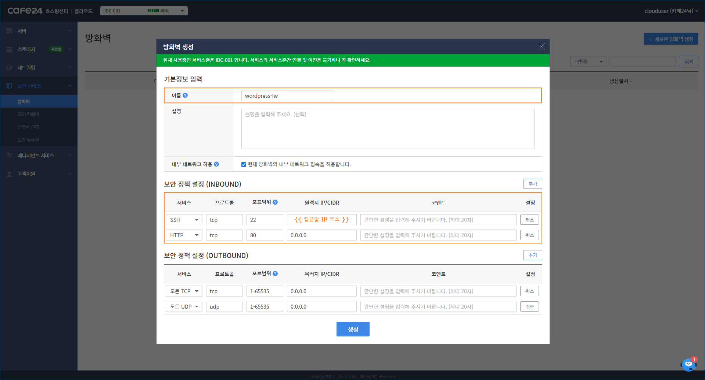
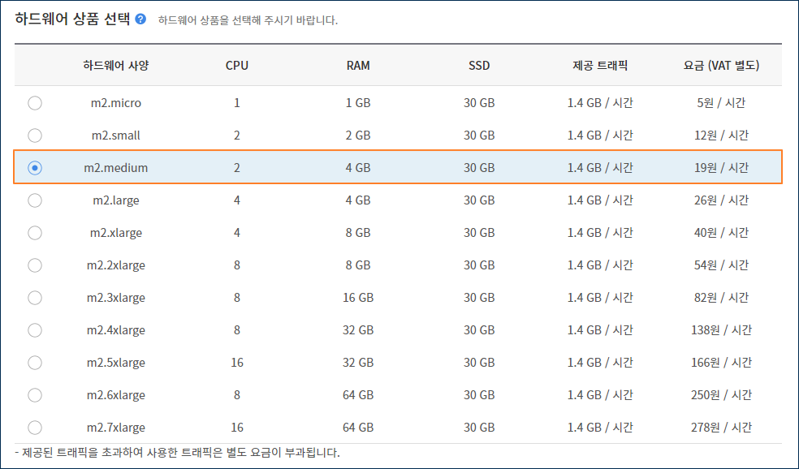
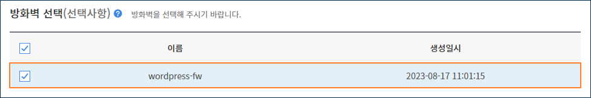
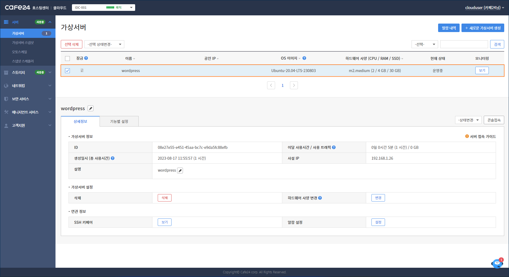
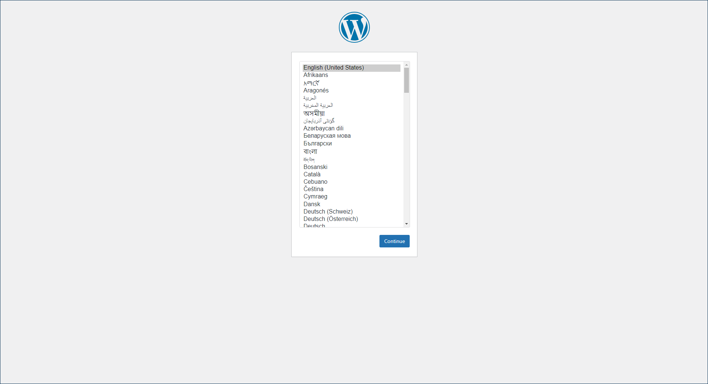

# WordPress 사용 방법

## 1. WordPress란?

워드프레스는 웹사이트, 홈페이지, 쇼핑몰, 블로그 제작 관련 오픈소스 프로그램입니다.

카페24 클라우드는 이러한 워드프레스가 설치된 가상서버를 제공하여, 바로 서비스를 시작할 수 있습니다.


<mark style="color:blue;">**참고사항**</mark>

WordPress가 설치된 가상서버에서 사용되는 소프트웨어는 다음과 같습니다.

* [Apache Web Server](https://httpd.apache.org/) (Version 2.4)
* [MariaDB Database Server](https://mariadb.org/) (Version 11.0)
* [PHP Programmin Language](https://www.php.net/) (Version 8.0)
* [WordPress](https://wordpress.com/ko/) (Version Latest)



## 2. WordPress 가상서버 생성하기

### (1) 방화벽 생성

<mark style="background-color:blue;">웹콘솔 > 보안 서비스 > 방화벽 > 새로운 방화벽 생성</mark>

SSH 접속을 위한 TCP 22번 포트와 웹 서비스 이용을 위한 TCP 80 포트를 허용하는 방화벽을 생성합니다.

<div align="left">

<figure><figcaption></figcaption></figure>

</div>


### (2) 이미지 선택

<mark style="background-color:blue;">웹콘솔 > 서버 > 가상서버 > 새로운 가상서버 생성</mark>

\[워드프레스 전용 OS로 설치]를 클릭한 후, 원하는 OS 이미지를 선택합니다.


### (3) 하드웨어 상품 선택

워드프레스 사용을 위해 최소 **m2.medium** 이상의 하드웨어 사양을 권장드립니다.

하드웨어 사양은 가상서버 생성 후에도 변경 가능합니다.

<div align="left">

<figure><figcaption></figcaption></figure>

</div>


### (4) 가상서버 이름 설정

생성할 가상서버의 이름을 설정합니다.

<div align="left">

<figure><figcaption></figcaption></figure>

</div>


### (5) SSH 키페어 설정

카페24 클라우드는 보안을 위해 패스워드 방식 대신 키페어 방식을 사용하여 가상서버에 접속할 수 있습니다.

SSH 키페어 설정은 [\[SSH 키페어 설정\]](https://docs.cafe24cloud.com/home/server/server/create#5.-ssh)을 참고해 주세요.

<div align="left">

<figure><figcaption></figcaption></figure>

</div>


<mark style="color:red;">**주의사항**</mark>

SSH 키페어의 개인키는 재발급이 불가능하기 때문에 보관에 유의해 주시기 바랍니다.



### (5) 공인IP 할당

웹 서비스 접속을 위한 공인IP를 할당합니다.

<div align="left">

<figure><figcaption></figcaption></figure>

</div>


### (6) 방화벽 선택

(1)에서 생성한 방화벽을 선택합니다.

<div align="left">

<figure><figcaption></figcaption></figure>

</div>


### (7) 가상서버 생성

설정이 모두 완료되면 \[가상서버 생성] 버튼을 클릭하여, 대시보드에서 생성된 가상서버를 확인할 수 있습니다.

<div align="left">

<figure><figcaption></figcaption></figure>

</div>


## 3. WordPress 가상서버 접속하기

SSH 키페어를 사용하여 가상서버에 접속하는 방법은 [\[가상서버 접속하기\]](https://docs.cafe24cloud.com/home/server/server/connect/keypair#2.)를 참고해 주세요.


## 4. WordPress 가상서버 사용하기

### (1) WordPress 설치 확인하기

가상서버에 접속하여 워드프레스 설치 로그 확인을 통해 정상적으로 설치되었는지 확인할 수 있습니다.

```sh
$ cat /cafe24/wordpress_install.log
----------------------------------------------------------------------
2023-08-17 02:57:12 [INFO] Start installing apache...
2023-08-17 02:57:31 [INFO] Apache installed successfully!
2023-08-17 02:57:32 [INFO] Apache enabled successfully!
2023-08-17 02:57:32 [INFO] Apache started successfully!
2023-08-17 02:57:32 [INFO] Start installing php...
2023-08-17 02:58:15 [INFO] Php installed successfully!
2023-08-17 02:58:15 [INFO] Start installing mariadb...
2023-08-17 02:58:52 [INFO] Mariadb installed successfully!
2023-08-17 02:58:53 [INFO] Mariadb enabled successfully!
2023-08-17 02:58:53 [INFO] Mariadb started successfully!
2023-08-17 02:58:53 [INFO] Start setting password and creating database...
2023-08-17 02:58:54 [INFO] Root password set successfully!
2023-08-17 02:58:54 [INFO] Wordpress database created successfully!
2023-08-17 02:58:54 [INFO] Start configuring wordpress...
2023-08-17 02:58:59 [INFO] Wordpress configured successfully!
2023-08-17 02:58:59 Wordpress Installation completed :)
2023-08-17 02:58:59 Check wordpress information! -> /cafe24/wordpress_info.txt
----------------------------------------------------------------------
```


<mark style="color:red;">**주의사항**</mark>

5 \~ 10분 정도 워드프레스 설치 시간이 소요되기 때문에

반드시 설치 로그 확인 후, 작업을 진행해 주시기 바랍니다.


또한, 웹으로 워드프레스에 접속하여 정상적으로 설치되었는지 확인할 수 있습니다.

접속 URL은 <mark style="color:blue;">http://{가상서버 공인 IP}</mark> 입니다.

<div align="left">

<figure><figcaption></figcaption></figure>

</div>


### (2) WordPress 정보 확인하기

아래의 경로에서 설치된 워드프레스에 대한 정보를 확인할 수 있습니다

```sh
$ cat /cafe24/wordpress_info.txt
----------------------------------------------------------------------
Wordpress Information of Cafe24 Cloud
----------------------------------------------------------------------

Website URL : {{ your_server_public_ip }}
Database Name : wordpress
Database User Name : root
Database User Password : {{ /cafe24/mariadb_password.txt }}
DocumentRoot : /var/www/wordpress

***** Please reset the root password! *****

----------------------------------------------------------------------
Apache Version
----------------------------------------------------------------------

Server version: Apache/2.4.41 (Ubuntu)
Server built:   2023-03-08T17:32:54

----------------------------------------------------------------------
PHP Version
----------------------------------------------------------------------

PHP 8.0.30 (cli) (built: Aug 14 2023 06:42:24) ( NTS )
Copyright (c) The PHP Group
Zend Engine v4.0.30, Copyright (c) Zend Technologies
    with Zend OPcache v8.0.30, Copyright (c), by Zend Technologies

----------------------------------------------------------------------
MariaDB Version
----------------------------------------------------------------------

mariadb from 11.0.3-MariaDB, client 15.2 for debian-linux-gnu (x86_64) using readline 5.2

----------------------------------------------------------------------
```


### (3) MariaDB 패스워드 확인하기

워드프레스 설치 시, mariadb의 root 패스워드는 랜덤 문자열로 설정됩니다.

초기 설정된 패스워드는 아래의 경로에서 확인할 수 있습니다.

```sh
$ cat /cafe24/mariadb_password.txt
oa9b7NXUWInmZn/DHxprlsf7Liw=
```

<mark style="color:red;">보안을 위해 서비스 전에 반드시 아래의 명령어를 실행하여 root 패스워드 변경 등을 진행해 주시기 바랍니다.</mark>

```
$ mariadb-secure-installation
```
