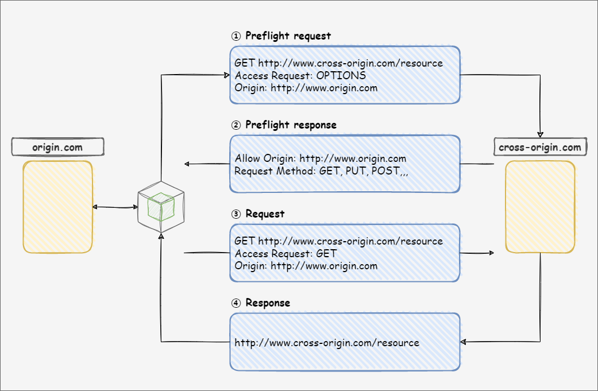

# 오브젝트 스토리지 CORS 설정 방법

## 1. CORS란?

CORS(Cross-Origin Resource Sharing)는 한 도메인에 로드된 클라이언트 웹 응용 프로그램이 다른 도메인의 리소스와 상호 작용하는 방법을 정의합니다.

CORS 기능을 사용하면, 웹 브라우저가 외부 웹 사이트나 서비스의 요청을 수행할 수 있는 도메인을 설정할 수 있도록 합니다.

<figure><figcaption></figcaption></figure>

예를 들어, 브라우저 스크립트가 다른 도메인의 리소스에 대해 GET 요청을 할 경우 다음과 같이 동작합니다.

① GET 요청을 보내기 전에 cross-origin 도메인의 리소스에 대한 OPTIONS 요청을 사전에 전송합니다.

② cross-origin 도메인은 요청한 리소스에 대해 origin 도메인이 수행 가능한 HTTP 요청 유형을 회신합니다.

③ 실제로 GET 요청을 전송합니다.

④ origin 도메인은 GET 요청 권한이 있는 도메인이기 때문에 요청한 리소스를 반환하여 응답합니다.


## 2. S3cmd 연동하기

본 매뉴얼은 S3cmd를 사용하여 CORS 설정을 진행합니다.

따라서 [<mark style="color:blue;">2. S3cmd 연동하기</mark>](s3cmd.md#2.-s3cmd)를 참고하여 S3cmd 연동을 먼저 진행해 주시기 바랍니다.


## 3. CORS 환경 구성하기

### (1) 버킷 생성하기

웹 사이트를 구성할 origin 버킷과 cross-origin 버킷을 생성합니다.

```shell-session
$ s3cmd mb s3://origin
Bucket 's3://origin/' created

$ s3cmd mb s3://cross-origin
Bucket 's3://cross-origin/' created

$ s3cmd ls
2023-02-10 04:59  s3://origin
2023-02-10 04:59  s3://cross-origin
```


### (2) 웹 사이트 버킷 구성하기

생성한 버킷을 웹 사이트 버킷으로 구성합니다.

웹 사이트 버킷으로 구성하게 되면, **https://{버킷명}.kr-website.cafe24obs.com** 형식의 정적 웹 사이트를 생성할 수 있습니다.

```shell-session
$ s3cmd ws-create s3://origin
Bucket 's3://origin/': website configuration created.

$ s3cmd ws-create s3://cross-origin
Bucket 's3://cross-origin/': website configuration created.
```


### (3) origin 버킷 페이지 생성하기

origin 웹 사이트 버킷의 index 페이지를 생성합니다.

cross-origin 웹 사이트 버킷의 cors 페이지 내용 가져올 수 있도록 합니다.

```shell-session
$ vi index.html
<!DOCTYPE html>
<html>
    <body>
        <h1>This is origin page.</h1>
    </body>

    <div id="fetchedcontent"/>
    
    <script>
        var fetchedcontent = document.getElementById("fetchedcontent");

        fetch('https://cross-origin.kr-website.cafe24obs.com/cors.html')
        .then((response) => {
            return response.text();
        })
        .then((html) => {
            fetchedcontent.innerHTML = html
        });
    </script>
</html>
```

작성한 index.html 파일을 origin 버킷에 업로드합니다.

이때 웹 브라우저에서 접근할 수 있도록 **--acl-public** 옵션을 통해 파일 권한을 공개로 설정하여 업로드합니다.

```shell-session
$ s3cmd put index.html s3://origin --acl-public
upload: 'index.html' -> 's3://origin/index.html'  [1 of 1]
 527 of 527   100% in    0s     8.78 KB/s  done
Public URL of the object is: http://kr.cafe24obs.com/origin/index.html
```


### (4) cross-origin 버킷 페이지 생성하기

마찬가지로 cross-origin 웹 사이트 버킷의 cors 페이지를 생성한 후, cross-origin 버킷에 업로드합니다.

```shell-session
$ vi cors.html
<b>This is from cross-origin page.</b>

$ s3cmd put cors.html s3://cross-origin --acl-public
upload: 'cors.html' -> 's3://cross-origin/cors.html'  [1 of 1]
 39 of 39   100% in    0s   695.60 B/s  done
Public URL of the object is: http://kr.cafe24obs.com/cross-origin/cors.html
```


## 4. CORS 설정하기

### (1) CORS 구성 요소

CORS Configuration은 버킷에 액세스할 수 있도록 허용할 origin과 각 origin에 대해 지원할 작업(HTTP Method) 및 기타 작업 별 정보를 식별하는 CORS Rule이 포함된 문서입니다.

CORS Configuration에는 최대 100개의 CORS Rule을 추가할 수 있으며, CORS Rule elements는 다음과 같습니다.

| CORS Rule elements |                                                                                              Description                                                                                              |
| :----------------: | :---------------------------------------------------------------------------------------------------------------------------------------------------------------------------------------------------: |
|    AllowedOrigin   |                                   http://www.example.com과 같은 cross-domain 요청을 허용할 origin을 지정합니다. origin 문자열에는 http://\*.example.com과 같은 \* 와일드카드 문자가 하나만 포함될 수 있습니다.                                  |
|    AllowedMethod   |                                                               허용할 origin에 대해 지원할 HTTP Method(GET / PUT / POST / DELETE / HEAD)를 지정합니다.                                                                |
|    AllowedHeader   |        Preflight 요청에서 허용되는 헤더를 지정합니다. [<mark style="color:blue;">Common Request Header</mark>](https://docs.aws.amazon.com/ko\_kr/AmazonS3/latest/API/RESTCommonRequestHeaders.html)를 참고해 주세요.        |
|    ExposeHeader    | 고객이 해당 애플리케이션에 액세스할 수 있도록 하는 응답 헤더를 식별합니다. [<mark style="color:blue;">Common Response Header</mark>](https://docs.aws.amazon.com/ko\_kr/AmazonS3/latest/API/RESTCommonResponseHeaders.html)를 참고해 주세요. |
|    MaxAgeSeconds   |                                                                              Preflight 요청에 대한 응답을 캐시할 수 있는 시간(초)을 지정합니다.                                                                              |


### (2) CORS 설정하기

origin 웹 사이트 버킷이 GET 요청 권한을 가질 수 있도록 CORS 설정 파일을 작성합니다.

```shell-session
$ vi corsrules.xml
<CORSConfiguration>
 <CORSRule>
   <AllowedOrigin>https://origin.kr-website.cafe24obs.com</AllowedOrigin>
   <AllowedMethod>GET</AllowedMethod>
 </CORSRule>
</CORSConfiguration>
```

작성한 corsrules.xml 파일을 사용하여 cross-origin 버킷의 CORS를 설정합니다.

```shell-session
$ s3cmd setcors corsrules.xml s3://cross-origin
```

설정된 CORS는 다음과 같이 확인할 수 있습니다.

```shell-session
$ s3cmd info s3://cross-origin
s3://cross-origin/ (bucket):
   Location:  zone-group-cafe24cloud
   Payer:     BucketOwner
   Expiration Rule: none
   Policy:    none
   CORS:      <CORSConfiguration xmlns="http://s3.amazonaws.com/doc/2006-03-01/"><CORSRule><AllowedMethod>GET</AllowedMethod><AllowedOrigin>https://origin.kr-website.cafe24obs.com</AllowedOrigin></CORSRule></CORSConfiguration>
   ACL:       democloud: FULL_CONTROL
```

origin 웹 사이트 버킷에 접속하면, cross-origin 웹 사이트 버킷의 cors 페이지 내용을 가져오는 것을 확인할 수 있습니다.

<figure><figcaption></figcaption></figure>


### (3) CORS 삭제하기

설정한 CORS는 다음과 같이 삭제할 수 있습니다.

```shell-session
$ s3cmd delcors s3://cross-origin
s3://cross-origin/: CORS deleted

$ s3cmd info s3://cross-origin
s3://cross-origin/ (bucket):
   Location:  zone-group-cafe24cloud
   Payer:     BucketOwner
   Expiration Rule: none
   Policy:    none
   CORS:      none
   ACL:       democloud: FULL_CONTROL
```

cross-origin 웹 사이트 버킷에 대한 GET 요청 권한이 없기 때문에 cors 페이지 내용을 가져오지 못하는 것을 확인할 수 있습니다.

<figure><figcaption></figcaption></figure>
