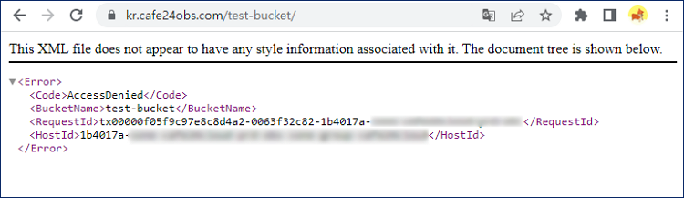

# 오브젝트 스토리지 데이터 암호화 적용 방법

## 1. 데이터 암호화 적용하기 (SSE-C)

SSE-C 방식으로 데이터를 암호화하여 오브젝트 스토리지에 업로드 할 수 있습니다.

파일은 사용자가 제공한 암호화 키로 AES-256 암호화되어 저장됩니다.

파일 암호화가 완료되면 사용된 암호화 키는 오브젝트 스토리지의 메모리에서 제거됩니다.

암호화된 파일을 다운로드 할 때는 동일한 암호화 키가 필요합니다. 암호가 일치할 경우 복호화된 파일을 다운받을 수 있습니다.


<mark style="color:red;">**주의 사항 1**</mark>

SSE-C 방식은 암호화 키를 사용자가 관리하는 것으로, <mark style="color:red;">키를 분실했을 경우 파일 다운로드가 불가능합니다.</mark>

<mark style="color:red;">암호화 키를 분실하지 않도록 주의해 주시기 바랍니다.</mark>&#x20;


<mark style="color:red;">**주의 사항 2**</mark>

s4cmd 또는  S3Browser를 이용해서 암호화 되어 업로드된 파일은 콘솔의 파일 매니저에서 상세 정보를 확인할 수 없습니다.&#x20;



본 매뉴얼에서는 s4cmd와 s3browser 에서 SSE-C 암호화 적용하는 방법을 제공합니다.&#x20;

* [s4cmd로 데이터 암호화](sse-c.md#2.-s4cmd)
* [s3browser로 데이터 암호화](sse-c.md#3.-s3browser)


## 2. s4cmd로 데이터 암호화

파일의 암호화, 복호화에 사용할 암호를 s4cmd 설정에 추가하여 사용하는 방법입니다.&#x20;

### (1) s4cmd 설치하기

#### python 3.8 설치

<mark style="color:blue;">s4cmd는 python3.7 이상의 버전과만 호환이 됩니다.</mark> 지원되는 python 버전을 고려하여 설치를 진행합니다. 본 매뉴얼에서는 3.8 버전으로 설치를 진행했습니다.&#x20;



<pre class="language-shell-session"><code class="lang-shell-session"><strong>$ sudo yum update
</strong>$ sudo yum install gcc openssl-devel bzip2-devel libffi-devel -y
<strong>$ curl -O https://www.python.org/ftp/python/3.8.1/Python-3.8.1.tgz
</strong>$ tar -xzf Python-3.8.1.tgz

$ cd Python-3.8.1/
$ ./configure --enable-optimizations
$ sudo make altinstall

$ python3.8 -V
  Python 3.8.1
</code></pre>



```shell-session
$ sudo apt update
$ sudo apt install python3.8

$ python3.8 --version
Python 3.8.0

ubuntu의 경우, pip 설치를 위한 패키지를 추가로 설치합니다.
$ sudo apt-get install python3-distutils
```




#### pip 설치&#x20;

앞서 설치한 python3.8 버전으로 pip를 설치합니다.

<pre class="language-shell-session"><code class="lang-shell-session">$ curl https://bootstrap.pypa.io/get-pip.py -o get-pip.py
<strong>$ python3.8 get-pip.py
</strong>$ pip -V 
  pip 23.0.1 from /home/centos/.local/lib/python3.8/site-packages/pip (python 3.8)
</code></pre>


#### s4cmd 설치

pip로 s4cmd 를 설치합니다.&#x20;

<pre class="language-shell-session"><code class="lang-shell-session"><strong>$ pip install s4cmd
</strong></code></pre>


### (2) API 키 등록하기

&#x20;다음 두 방법 중 한 가지를 이용하여 API 키를 등록할 수 있습니다.

#### 기존 s3cmd 설정 사용하기

기존에 s3cmd를 사용하고 있어서 \~/.s3cfg 파일에 API 키가 등록이 되어 있을 경우 별도의 작업 없이 그대로 사용할 수 있습니다.

s3cmd 초기 설정은 [\[오브젝트 스토리지 s3cmd 사용 방법\]](s3cmd.md)을 참고해 주세요.


#### API 키를 환경 변수로 설정하기

s3cmd 사용 없이 s4cmd를 처음 설치하여 사용하는 경우, API 키를 환경 변수로 저장합니다.

카페24 오브젝트 스토리지의 API 키를 확인하는 방법은[ \[오브젝트 스토리지 사용 방법\] ](use.md#2.) 참고해 주세요.

```shell-session
$ export S3_ACCESS_KEY=[access_key]
$ export S3_SECRET_KEY=[secret_key]
```

위와 같이 설정할 경우 현재 접속한 세션에 대해서만 환경 변수가 적용됩니다.

가상서버에 다시 접속 했을 때도 영구적으로 적용하기 원하실 경우 다음과 같이 추가해 주세요.

```shell-session
$ cat | sudo tee /etc/profile.d/s4cmdkey.sh << EOF
export S3_ACCESS_KEY=[access_key]
export S3_SECRET_KEY=[secret_key]
EOF
```

\


### (3) 암호 정하기

데이터 암호화에 사용할 32자의 암호를 생각합니다. 해당 암호는 s4cmd로 파일을 업로드, 다운로드 할 때 오브젝트 스토리지 서버로 전달 됩니다.


<mark style="color:blue;">**참고 사항**</mark>

암호는 반드시 32자여야 합니다. 32자를 만족하지 않을 경우 에러가 발생합니다.



<mark style="color:red;">**주의 사항**</mark>

<mark style="color:red;">키를 분실했을 경우 파일을 다운로드 할 수 없습니다.</mark>

<mark style="color:red;">암호화 키를 분실 하지 않도록 주의해 주시기 바랍니다.</mark>&#x20;



### (4) 파일 업로드 하기

평문의 파일을 암호화 하여 버킷에 업로드 합니다.사용하는 옵션은 다음과 같습니다.

* \--endpoint-url : 오브젝트 스토리지의 엔드포인트로, https://kr.cafe24obs.com 를 입력합니다.
* \--API-SSECustomerAlgorithm : 암호화 알고리즘으로 AES256 을 입력합니다.
* \--API-SSECustomerKey : 파일 암호화에 사용할 암호를 입력합니다.

```shell-session
$ s4cmd put 업로드_할_파일 s3://버킷이름/[파일이름]  \
--endpoint-url https://kr.cafe24obs.com \
--API-SSECustomerAlgorithm=AES256 \
--API-SSECustomerKey=[암호화 키] 
```


### (5) 파일 다운로드 받기

암호화된 파일을 다운 받을 때는 복호화를 진행할 암호 키를 함께 제공합니다.

암호를 제공하지 않거나, 제공한 암호가 파일 암호화에 사용된 것과 다를 경우 파일을 다운로드 할 수 없습니다.

* \--endpoint-url : 오브젝트 스토리지의 엔드포인트로, https://kr.cafe24obs.com 를 입력합니다.
* \--API-SSECustomerAlgorithm : 암호화 알고리즘으로 AES256 을 입력합니다.
* \--API-SSECustomerKey : 파일 암호화에 사용할 암호를 입력합니다.

<pre class="language-shell-session"><code class="lang-shell-session">$ s4cmd get s3://버킷이름/[다운로드 받을 파일] \
--endpoint-url https://kr.cafe24obs.com \
--API-SSECustomerAlgorithm=AES256 \
<strong>--API-SSECustomerKey=[암호화 키] 
</strong></code></pre>


브라우저를 통해 암호화 키 없이 파일에 접근할 경우, 파일의 데이터가 노출되지 않습니다.

<figure><figcaption></figcaption></figure>


## 3. S3Browser로 데이터 암호화

파일의 암호화, 복호화에 사용할 키를  S3browser 설정에 추가하여 사용하는 방법입니다.

### (1) S3 Browser 계정 연동&#x20;

s3borwser의 설치를 진행합니다. SSE-C 기능을 사용하기 위해 최신 버전을 다운 받는 것을 권장 드립니다.

* s3 Browser 설치 :[ \[s3Browser공식페이지\]](https://s3browser.com/)

S3 Browser를 설치한 다음 <mark style="background-color:blue;">Accounts > Add new account</mark> 를 클릭합니다.&#x20;

S3 Browser에 계정을 연동하기 위해 관련 정보를 기입합니다.&#x20;

<div align="left">

<figure><figcaption></figcaption></figure>

</div>

카페24 오브젝트 스토리지의 API 키를 확인하는 방법은[ \[오브젝트 스토리지 사용 방법\] ](use.md#2.)를 참고해 주세요.

① Account Name : 등록하는 계정의 이름을 지정합니다.&#x20;

② Account Type : "S3 Compatible Storage" 를 선택합니다.&#x20;

③ REST Endpoint : "kr.cafe24obs.com" 을 입력합니다.&#x20;

④ Access Key ID : 오브젝트 스토리지의 Access Key를 입력합니다.

⑤ Secret Key : 오브젝트 스토리지의 Secret Key를 입력합니다.

⑥ Use secure transfer : 오브젝트 업로드, 다운로드 시에 SSL/TLS 방식을 사용하는 것으로, 활성화합니다.&#x20;

⑦ Advanced S3-compatible storage settings 를 클릭합니다.

<div align="left">

<figure><figcaption></figcaption></figure>

</div>

Advanced S3-compatible storage settings 를 클릭한 다음, Signature 버전이 "Signature V4"인지 확인합니다. V2일 경우 SSE-C 기능을 사용할 수 없기 때문에 V4로 설정해 주시기 바랍니다. 확인 후 모든 설정을 저장합니다.

<div align="left">

<figure><figcaption></figcaption></figure>

</div>


### (2)  데이터 암호화 활성화

계정 연동이 완료된 후, <mark style="background-color:blue;">Tools > Server Side Encryption Rules</mark> 매뉴로 접근합니다.

데이터 암호화를 위한 규칙을 생성하여 적용할 수 있습니다.&#x20;

<div align="left">

<figure><figcaption></figcaption></figure>

</div>

하단의 "Add" 버튼을 클릭합니다.&#x20;

<div align="left">

<figure><figcaption></figcaption></figure>

</div>


① 암호화 규칙을 적용할 버킷을 지정합니다.&#x20;

② 암호화 규칙을 적용할 파일 혹은 디렉터리를 지정합니다. "\*" 로 설정할 시에 모든 파일에 대해 적용됩니다.&#x20;

③ Server-Side Encryption with Customer-Provided Keys (SSE-C)를 선택합니다.&#x20;

④ 32자의 암호화 키를 입력합니다.&#x20;


<mark style="color:red;">**주의 사항**</mark>

SSE-C 방식은 암호화 키를 사용자가 관리하는 것으로, <mark style="color:red;">키를 분실했을 경우 파일을 다운로드 할 수 없습니다.</mark>&#x20;

<mark style="color:red;">분실하지 않도록 주의해 주시기 바랍니다.</mark>&#x20;


⑤ 생성하는 룰을 바로 적용하도록 합니다.

⑥ Add new rule을 클릭하여 변경  사항을 저장합니다.&#x20;

<div align="left">

<figure><figcaption></figcaption></figure>

</div>

test-bucket에 대한 규칙이 생성된 것을 확인할 수 있습니다.&#x20;

Save Changes를 눌러 변경 사항을 저장합니다.&#x20;

<div align="left">

<figure><figcaption></figcaption></figure>

</div>


### (3) S3 Browser 파일 업로드

① 앞서 암호화 규칙을 적용한 버킷을 클릭합니다.&#x20;

② 버킷에 파일을 업로드합니다.&#x20;

<div align="left">

<figure><figcaption></figcaption></figure>

</div>


업로드한 파일을 클릭한 후, Headers 탭에서 암호화에 대한 메타데이터가 적용되었음을 확인할 수 있습니다.

<div align="left">

<figure><figcaption></figcaption></figure>

</div>


### (4) S3Browser 파일 다운로드

암호화 규칙 설정에 암호화 키가 등록된 상태에서 해당 파일을 다운로드 합니다.

<div align="left">

<figure><figcaption></figcaption></figure>

</div>

데이터가 정상적으로 복호화 되어 PC에 저장된 것을 확인할 수 있습니다.

<div align="left">

<figure><figcaption></figcaption></figure>

</div>

S3 Browser의 암호화 규칙 설정에서 암호화 키가 삭제되거나 변경되었을 경우 파일을 다운로드 할 수 없습니다.

<div align="left">

<figure><figcaption></figcaption></figure>

</div>


