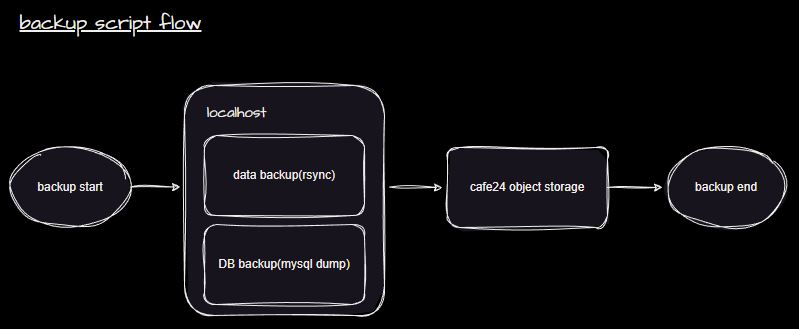

# 오브젝트 스토리지를 이용한 데이터 백업 방법


## 0. 사전 준비&#x20;

### (1) 오브젝트 스토리지 신청 및 S3cmd 설치&#x20;

아래 매뉴얼을 참고하여 오브젝트 스토리지 신청 및 S3cmd 설치가 선행되어야 합니다.

[\[오브젝트 스토리지 신청\]](https://docs.cafe24cloud.com/home/storage/object/use#2.)\
[\[S3cmd 설치 및 연동\]](https://docs.cafe24cloud.com/home/storage/object/s3cmd)&#x20;

### (2) 시간 동기화 및 cron 설정&#x20;

백업 스크립트를 cron 서비스에 등록하여 일정 주기로 실행할 수 있습니다. \
때문에 서버 OS내 시간과 실제 시간간 동기화가 이루어져야 설정한 시간에 백업이 진행됩니다. \
시간 동기화는 아래 매뉴얼을 참고하시기 바랍니다.&#x20;

[\[OS 시간 동기화\]](https://docs.cafe24cloud.com/home/server/server/config/ntp)

cron 서비스에 스케줄 등록 방법은 아래와 같습니다.

```
#### 아래 명령어를 통해 crontab 파일을 엽니다.
$ crontab -e 

#### 스케줄 등록 방법 
*     *     *     *     *  command to be executed
-     -     -     -     -
|     |     |     |     |
|     |     |     |     +----- day of the week (0 - 6) (Sunday = 0)
|     |     |     +------- month (1 - 12)
|     |     +--------- day of the month (1 - 31)
|     +----------- hour (0 - 23)
+------------- min (0 - 59)

#### 백업 스크립트 등록 예시
#### 매일 08시 45분에 /bin/bash /home/include_mysql_pw_backup.sh 스크립트를 실행함
45 8 * * * /bin/bash /home/include_mysql_pw_backup.sh

#### 스케줄 등록후 crond 서비스 리로드하여 적용
$ systemctl reload crond
```

cron 서비스는 백그라운드로 실행되며 스크립트 파일에 실행 권한이 없을 경우, cron 서비스에 스케줄을 등록하여도 스크립트가 실행되지 않습니다. 백업 스크립트 파일에 실행 권한이 있는지 확인하시기 바랍니다.

```
#### 아래와 같이 실행 권한이 없음
$ ls -alt exclude_mysql_pw_backup.sh
-rw-r--r--. 1 root root 2536 Apr  6 09:41 exclude_mysql_pw_backup.sh

#### user에 대하여 실행(x) 권한 부여
$ chmod u+x exclude_mysql_pw_backup.sh

#### root 계정에 대하여 실행 권한 부여됨
$ ls -alt exclude_mysql_pw_backup.sh
-rwxr--r--. 1 root root 2536 Apr  6 09:41 exclude_mysql_pw_backup.sh
```

### (3) 디스크 여유 공간 체크

백업이 진행되는 동안 OS내 생성된 데이터를 오브젝트 스토리지로 업로드후 삭제됩니다.

원활한 백업 및 서비스 운영을 위해 1일치 백업 데이터의 여유 공간을 확보하시기 바랍니다.

## 1. 백업 스크립트 동작 방식 및 스크립트 설정

백업 스크립트의 동작 방식은 rsync 및 mysqldump 명령어를 통해 데이터 및 DB를 로컬 호스트에 백업후 \
백업된 데이터를 s3cmd 명령어를 통해 오브젝트 스토리지로 데이터 업로드됩니다.

<figure><figcaption><p>백업 스크립트 동작 순서</p></figcaption></figure>

data 백업만 원하실 경우, 스크립트내 "\_MysqlDump" 를  주석 처리\
DB 백업만 원하실 경우, 스크립트내 "\_Data\_Backup"를 주석 처리 하시기 바랍니다.

```
function _Main() {

   mkdir -p ${BACKUP_DIR}
   mkdir -p ${LOG_DIR}

   BACKUP_S_TIME=$(date)
   echo ${BACKUP_S_TIME} >> ${START_LOG}

   _Data_Backup -> DB 백업만 원할 경우 해당 라인 주석

   _MySQL_Dump  -> data 백업만 원할 경우 해당 라인 주석

   _Upload_OBS  

   rm -rf ${BACKUP_DIR}/${KEEP_DATE}_${HOST}

   BACKUP_E_TIME=$(date)
   echo ${BACKUP_E_TIME} >> ${END_LOG}

}
```

### (1) 변수 설정

**MYSQL\_PW="####"**  -> mysql root 패스워드가 포함된 스크립트를 사용할때 설정.\
&#x20;                                       \#### 안에 mysql root 패스워드 입력

**DUMP\_OPTION=""**      -> mysqldump시 적용되는 옵션으로 기본값은 아래와 같다.\
&#x20;                              "--max-allowed-packet=1024M --add-drop-table --add-drop-database --single-transaction"

**SRC\_DIR=""**                 -> data backup 진행시 백업되는 경로. \
&#x20;                                        기본값 :  /home

**BACKUP\_DIR=""**         -> 백업 데이터가 저장되는 localhost 디렉토리 경로.\
&#x20;                                        설정한  디렉토리에 "\[백업날짜]\_\[hostname]" 형식으로 디렉토리가 생성되며 \
&#x20;                                        해당 디렉토리를 오브젝트 스토리지에 업로드 함. \
&#x20;                                        기본값 : /home/backup

**OBS\_BUCKET="###"** -> localhost에 백업된 데이터를 업로드할 오브젝트 스토리지 버킷명.\
&#x20;                                        \### 안에 버킷명 입력 (eg. s3://backup)

### (2) 로그&#x20;

**LOG\_DIR="${BACKUP\_DIR}/log"**                          -> 로그 파일이 저장되는 디렉토리

**LOG\_FILE="${LOG\_DIR}/rsync\_backup.log"**       -> data 백업(rsync) 발생되는 로그&#x20;

**OBS\_LOG\_FILE="${LOG\_DIR}/obs\_upload.log"**  -> 오브젝트 스토리지에 데이터 업로드할 때 발생되는 로그

**START\_LOG="${LOG\_DIR}/backup\_start.log"**    -> 백업 시작 시간 로그

**END\_LOG="${LOG\_DIR}/backup\_end.log"**          -> 백업 완료 시간 로그


## 2. 백업 스크립트 등록 및 구동


2 종류의 백업 스크립트를 제공하며 각 스크립트는 고객님 서비스 환경에 맞게 커스텀하여 이용해 주시기 바랍니다.&#x20;


```sh
#### 원하시는 두 스크립트중 선택하여 아래 명령어를 통해 다운로드 받습니다.

#### mysql root 패스워드가 스크립트에 포함된 백업 스크립트
$ curl https://kr.cafe24obs.com/cafe24-cloud-backup/include_mysql_pw_backup.sh >> /home/include_mysql_pw_backup.sh

#### mysql root 패스워드가 스크립트에 포함되지 않는 백업 스크립트
$ wget https://kr.cafe24obs.com/cafe24-cloud-backup/exclude_mysql_pw_backup.sh >> /home/exclude_mysql_pw_backup.sh
```

### (1) mysql root 패스워드가 포함된 백업 스크립트


### (2) mysql root 패스워드가 포함되지 않는 백업 스크립트

스크립트에 mysqldump 명령어 실행시 -p(-- password) 옵션을 사용하여 비밀번호를 직접 입력하여 \
DB 데이터를 추출하는 방식은 보안상 취약하여 권장하는 방식이 아닙니다. (스크립트가 실행되면서 다른 사용자가 명령어 히스토리나 프로세스 목록을 모니터링하고 있을 경우 패스워드가 노출될 우려가 있습니다.)

하여 "mysql\_config\_editor" 유틸리티를 이용하여 난독화된 인증 자격 증명을 저장하고 "-p" 옵션이 아닌\
&#x20;"--login-path=root" 옵션으로 변경하여 접속하는 방식을 권장드립니다.&#x20;

아래 명령어는 "mysql\_config\_editor" 유틸리티를 이용한 mysql 접속 방법입니다.&#x20;

```bash
$ mysql_config_editor set --login-path=root --host=localhost --user=root --password --port=3306
Enter password: [root 패스워드 입력]
 
$ ls -alt /root/.mylogin.cnf          ####해당 파일이 생성되었는지 확인 
-rw------- 1 root root 156 Mar 22 10:38 /root/.mylogin.cnf
 
$ mysql --login-path=root             ####"--login-path=root" 옵션으로 패스워드 없이 mysql 접근 가능한지 확인
Welcome to the MySQL monitor.  Commands end with ; or \g.
Your MySQL connection id is 3958
Server version: 8.0.32-0ubuntu0.20.04.2 (Ubuntu)
 
Copyright (c) 2000, 2023, Oracle and/or its affiliates.
 
Oracle is a registered trademark of Oracle Corporation and/or its
affiliates. Other names may be trademarks of their respective
owners.
 
Type 'help;' or '\h' for help. Type '\c' to clear the current input statement.
 
mysql>
```

위와 같이 "mysql\_config\_editor" 유틸리티 설정이 완료하셨을 경우, "--login-path=root" 옵션을 이용하여 mysql 접속이 가능하며 "**mysql root 패스워드가 포함되지 않는 백업 스크립트**" 사용이 가능합니다.

