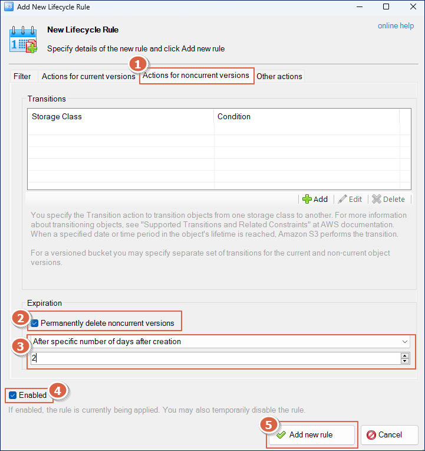

# 오브젝트 스토리지 버전 관리 기능 사용 방법

## 1.   버킷의 버전 관리 기능이란?

카페24 클라우드의 오브젝트 스토리지는 AWS S3의 API와 호환되어, AWS S3의 버킷 버전 관리 기능을 동일하게 사용할 수 있습니다.&#x20;

버전 관리는 버킷 내의 모든 오브젝트가 여러 개의 버전을 가질 수 있도록 하는 방법입니다.&#x20;

버킷에 버전 관리가 활성화 되어있으면 모든 객체에 대해 고유한 버전 ID가 부여됩니다.

예를 들어서 동일한 이름으로 수정된 파일을 업로드 할 경우, 이전 버전(ex. 버전ID aaaa)은 그대로 보존되며, 가장 최근에 업로드 한 것이 최신 버전(ex. 버전ID bbbb)으로 보여지게 됩니다.


버전 관리 기능을 활성화 하면 다음과 같은 상황에서 유용하게 사용할 수 있습니다.

* 의도치 않게 덮어씌워진 파일에 대해 이전 버전 다운로드
* 실수로 삭제한 파일의 복구


<mark style="color:blue;">**참고 사항**</mark>

버전 관리 기능이 활성화된 버킷에 속한 오브젝트는 업데이트 혹은 삭제가 이뤄질 때 기존 데이터에 변경을 주지 않습니다.&#x20;

예를 들어, 동일한 파일명으로 업로드를 하면, 기존 오브젝트는 보존되며 새로 업로드하는 오브젝트에 대해 새로운 ID가 부여됩니다.&#x20;

<mark style="color:blue;">오브젝트를 삭제하였을 경우에도 삭제 마커를 삽입하는 것이며 실제로 해당 데이터를 삭제하지 않습니다.</mark>&#x20;


<figure><figcaption></figcaption></figure>


<mark style="color:red;">**주의 사항**</mark>

<mark style="color:red;">각 버전은 개별적인 오브젝트로 간주되어 과금 됩니다.</mark>&#x20;

예를 들어서 A라는 오브젝트에 대해 3개의 버전이 관리되고 있다면, 3개 오브젝트에 대한 과금이 이뤄집니다.&#x20;

불필요한 과금을 막기 위해서는 사용하지 않는 버전의 오브젝트를 영구적으로  삭제해 주시기 바랍니다.&#x20;

특정 버전의 오브젝트를  삭제하는 방법은 다음을 참고해 주세요.&#x20;

* [AWS s3api cli 로 삭제하기](undefined-2.md#6-versioning)
* [S3 Browser에서 삭제하기](undefined-2.md#6-versioning-1)



#### 버전 관리 여부에 대한 버킷 상태

* **버전 관리 미사용** : 기본값으로, 아무것도 설정하지 않았을 경우 버킷은 버전 관리를 사용하지 않습니다.&#x20;
* **버전 관리 사용** : 버전 관리를 활성화한 상태입니다.&#x20;
* **버전 관리 일시 중지** : 버전 관리를 한번 사용하기 시작하면 '미사용' 상태로 돌아갈 수 없습니다. 그 대신 '일시 중지' 상태로 변경합니다.&#x20;


#### 버전 관리 방법

아래와 같은 방법으로 버전 관리 기능을 변경하고, 특정 버전의  오브젝트를 다운로드 할 수 있습니다.&#x20;

* [aws cli 사용하기](undefined-2.md#2.-aws-s3api-cli)
* [S3 Browser 사용하기](undefined-2.md#3.-s3-browser)


## 2. AWS s3api CLI 사용하기

AWS s3api CLI를 사용하면 터미널의 프롬프트에서 명령어를 통해 오브젝트 스토리지 서비스를 제어할 수 있습니다. &#x20;

#### 참고 문서

* [최신 버전의 AWS CLI 설치 또는 업데이트](https://docs.aws.amazon.com/ko\_kr/cli/latest/userguide/getting-started-install.html)
* [s3api cli 레퍼런스 ](https://awscli.amazonaws.com/v2/documentation/api/latest/reference/s3api/index.html)


### (1) aws cli 설치 및 연동

다음과 같은 방법으로 aws cli를 설치합니다.&#x20;

```shell-session
$ curl "https://awscli.amazonaws.com/awscli-exe-linux-x86_64.zip" -o "awscliv2.zip"
$ unzip awscliv2.zip
$ sudo ./aws/install
```


카페24 클라우드의 오브젝트 스토리지에 접근하기 위해 API key를 이용한 인증 과정을 수행합니다.\
&#x20;Access Key와 Secret Key 조회 방법은[ \[오브젝트 스토리지 사용 방법\]](use.md)을 확인해 주세요

```shell-session
$ aws configure
AWS Access Key ID [none]: Access Key 입력
AWS Secret Access Key [none]: Secret Key 입력
Default region name [None]: [Enter]
Default output format [None]: [Enter]
```


다음 명령어로 버킷 리스트를 출력하여 연동이 정상적으로 이뤄졌는지 확인합니다.&#x20;

```shell-session
$ aws s3api --endpoint-url=https://kr.cafe24obs.com:443 list-buckets
```


### (2) 버킷의 버전 관리 활성화/ 비활성화

#### 활성화하기

test-bucket이라는 이름의 버킷의 버전 관리 기능을 활성화합니다.

```shell-session
$ aws s3api  --endpoint-url=https://kr.cafe24obs.com:443  put-bucket-versioning --bucket test-bucket  --versioning-configuration Status=Enabled
```


#### 비활성화하기

test-bucket이라는 이름의 버킷의 버전 관리 기능을 일시 중지시킵니다.&#x20;

```shell-session
$ aws --endpoint-url=https://kr.cafe24obs.com:443 s3api  put-bucket-versioning --bucket test-bucket  --versioning-configuration Status=Suspended
```


#### 활성화 여부 확인하기

반환받은 결괏값의  "Status" 필드를 확인합니다.&#x20;

* Enabled : 버킷에 버전 관리 기능이 활성화 되어 있습니다.&#x20;
* Suspended : 버킷의 버전 관리 기능이 일시 중지 상태입니다. 버전 관리 기능으로 인해 기존에 생성된 오브젝트들은 여전히 동일하게 유지됩니다.

```shell-session
$ aws s3api get-bucket-versioning --endpoint-url=https://kr.cafe24obs.com:443 --bucket test-bucket
{
    "Status": "Enabled",
    "MFADelete": "Disabled"
}
```


### (3) 오브젝트의 Versioning 동작 확인하기

버전 관리가 활성화된 버킷의 동작 원리를 이해하기 위해 신규 파일을 업로드 합니다.&#x20;

"Initial contents"라는 내용의 파일을 업로드 합니다.&#x20;

```shell-session
$ cat demo-file.txt
Initial contents
```


버킷에 업로드 후, "VersionID" 가 반환된 것을 확인할 수 있습니다.

* \--key : 버킷에 저장할 오브젝트명. 오브젝트를 구분하는 key가 됩니다.&#x20;
* \--body :  로컬에서의 파일명

```shell-session
$ aws s3api put-object --bucket test-bucket --endpoint-url=https://kr.cafe24obs.com:443 --key demo-file.txt  --body demo-file.txt
{
    "ETag": "\"e8286a107c2b48016055496ac708b0a2\"",
    "VersionId": "nZCIQJ1UoZ.bs2HJ0ubbFjxBmSPZjIW"
}
```


동일한 파일을 수정하여 다시 업로드 합니다.&#x20;

```shell-session
$ cat demo-file.txt
Initial contents
Modification 1

$ aws s3api put-object --bucket test-bucket --endpoint-url=https://kr.cafe24obs.com:443 --key demo-file.txt  --body demo-file.txt
{
    "ETag": "\"316cdd4401e533838df20ffd93ab4557\"",
    "VersionId": "sXJ0gbWoPkNTvYZGGd0zsdQ3kstCago"
}

$ cat demo-file.txt
Initial contents
Modification 1
Modification 2

$ aws s3api put-object --bucket test-bucket --endpoint-url=https://kr.cafe24obs.com:443 --key demo-file.txt  --body demo-file.txt
{
    "ETag": "\"643a9835b2ce4f0136b4b8226a5cea85\"",
    "VersionId": "3jCrp0Jqsrn2oclnORIMiyQPXr0kMfY"
}
```


### (4) 버킷의 버전 히스토리 확인하기

특정 버킷에 대한 버전 히스토리는 다음과 같이 조회합니다.&#x20;

앞서 수정을 거듭하며 업로드한 demo-file.txt에 대해 개별적인 VersionId를 확인할 수 있습니다.&#x20;

```shell-session
$  aws s3api list-object-versions  --endpoint-url=https://kr.cafe24obs.com:443 --bucket test-bucket
{
    "Versions": [
        {
            "ETag": "\"643a9835b2ce4f0136b4b8226a5cea85\"",
            "Size": 47,
            "StorageClass": "STANDARD",
            "Key": "demo-file.txt",
            "VersionId": "3jCrp0Jqsrn2oclnORIMiyQPXr0kMfY",
            "IsLatest": true,
            "LastModified": "2023-03-17T06:47:22.969000+00:00",
            "Owner": {
                "DisplayName": "clouduser",
                "ID": "clouduser"
            }
        },
        {
            "ETag": "\"316cdd4401e533838df20ffd93ab4557\"",
            "Size": 32,
            "StorageClass": "STANDARD",
            "Key": "demo-file.txt",
            "VersionId": "sXJ0gbWoPkNTvYZGGd0zsdQ3kstCago",
            "IsLatest": false,
            "LastModified": "2023-03-17T06:46:36.079000+00:00",
            "Owner": {
                "DisplayName": "clouduser",
                "ID": "clouduser"
            }
        },
....
```


### (5) 특정 버전의 오브젝트 다운 받기

특정 버전의 오브젝트를 다운로드 받을 때는 "--version-id" 옵션의 인자값으로 다운받으려는 버전의 VersionID 값을 전달합니다. VersionID는 [버킷의 버전 히스토리 확인하기](undefined-2.md#4) 명령어로 확인할 수 있습니다.&#x20;

다음 명령어는 demo-file.txt 파일의  VersionId가 sXJ0gbWoPkNTvYZGGd0zsdQ3kstCago 인 버전을 demo-file-v1.txt 라는 이름으로 다운로드함을 의미합니다.&#x20;

```shell-session
$ aws s3api get-object  --endpoint-url=https://kr.cafe24obs.com:443 --bucket test-bucket --key demo-file.txt --version-id sXJ0gbWoPkNTvYZGGd0zsdQ3kstCago demo-file-v1.txt
{
    "AcceptRanges": "bytes",
    "LastModified": "2023-03-17T06:46:36+00:00",
    "ContentLength": 32,
    "ETag": "\"316cdd4401e533838df20ffd93ab4557\"",
    "VersionId": "sXJ0gbWoPkNTvYZGGd0zsdQ3kstCago",
    "ContentType": "binary/octet-stream",
    "Metadata": {}
}
```


demo-file-v1.txt 파일이 다운로드 된 것을 볼 수 있습니다.&#x20;

```shell-session
$ ls
demo-file-v1.txt  demo-file.txt
```


demo-file-v1.txt  파일을 열어보면 가장 처음 업로드 한 원본 버전임이 확인됩니다.&#x20;

```shell-session
$ cat demo-file-v1.txt
Initial contents
```


### (6)  Versioning 활성화된 오브젝트 삭제하기

<mark style="color:red;">**각 버전은 개별적인 오브젝트로 간주되어 과금 됩니다.**</mark>&#x20;

불필요한 과금을 막기 위해서 사용하지 않는 버전의 오브젝트를 영구적으로 삭제해 주시기 바랍니다.&#x20;

#### 특정 버전의 오브젝트 삭제하기

다음 명령어는 demo-file.txt 파일의  VersionId가 sXJ0gbWoPkNTvYZGGd0zsdQ3kstCago 인 버전을 삭제한다는 것을 의미합니다. VersionID는 [버킷의 버전 히스토리 확인하기](undefined-2.md#4) 명령어로 확인할 수 있습니다.&#x20;

```
$ aws s3api delete-object  --endpoint-url=https://kr.cafe24obs.com:443 --bucket test-bucket --key demo-file.txt --version-id sXJ0gbWoPkNTvYZGGd0zsdQ3kstCago
```


#### 라이프 사이클 규칙 적용하기

라이프사이클 규칙을 버킷에 적용하여 최신 버전 이전의 오브젝트들을 주기적으로 자동 삭제할 수 있습니다. s3cmd cli를 사용하여 라이프사이클 규칙을 적용하는 방법은 다음과 같습니다.&#x20;


<mark style="color:blue;">**참고 사항**</mark>

라이프 사이클 규칙이 만족되는 시점부터 작업이 실제로 완료되는 시점까지 지연이 발생할 수 있습니다.&#x20;

AWS S3 라이프사이클 규칙은 내부적으로 오브젝트의 삭제 수행 시간을 규칙이 충족된 날로부터 다음날 자정(UTC 기준)으로 인식합니다.&#x20;

자세한 사항은[ \[수명 주기 규칙: 객체 기간 기반\]](https://docs.aws.amazon.com/ko\_kr/AmazonS3/latest/userguide/intro-lifecycle-rules.html#intro-lifecycle-rules-number-of-days) 을 참고해 주시기 바랍니다.


* [오브젝트 스토리지 S3cmd 사용 방법](s3cmd.md#14-lifecycle)


## 3. S3 Browser 사용하기

S3 Browser 는 카페24 클라우드의 오브젝트 스토리지와 연동하여 사용할 수 있는 Windows 클라이언트 도구입니다. 오브젝트 스토리지의 API키를 S3 Browser에 등록하여 PC와 오브젝트 스토리지 간에 파일을 업로드, 다운로드 할 수 있습니다.


### (1) S3 Browser 설치 및 연동

S3 Browser의 설치 및 API 키 연동은 [\[오브젝트 스토리지 S3Browser 사용 방법\]](s3browser.md)을  참고해 주세요.


### (2) 버킷의 버전 관리 활성화 / 비활성화

S3 Browser에서 다음과 같은 방법으로 버킷의 버전 관리 기능을 설정할 수 있습니다.&#x20;

① 적용할 버킷을 선택합니다.&#x20;

② 상단의 "Buckets" 매뉴를 클릭합니다.&#x20;

③ "Edit Versioning Settings" 매뉴를 클릭합니다.&#x20;

<figure><figcaption></figcaption></figure>


① 버전 관리 기능을 활성화하는 버킷의 이름을 확인한 후, 맞으면 체크를 합니다.&#x20;

② OK 눌러 설정을 저장합니다.&#x20;

<figure><figcaption></figcaption></figure>


### (3) 오브젝트의 Versioning 동작 확인하기

① 버전 히스토리를 확인할 오브젝트를 클릭합니다.&#x20;

② "Versions" 탭을 클릭합니다.&#x20;

③ 업로드 한 오브젝트가 "revision #1"로 확인되며 Version ID도 조회할 수 있습니다.&#x20;

<figure><figcaption></figcaption></figure>


PC 에서 demo-file.txt 를 수정하여 업로드 한 뒤, 버전 히스토리를 확인합니다.&#x20;

① 버전 내역을 확인할 오브젝트를 선택합니다.&#x20;

② Versions 탭을 클릭합니다.&#x20;

③ 가장 최근에 업로드한 오브젝트의 버전이 "revision #2" 로 추가되었습니다.&#x20;

<figure><figcaption></figcaption></figure>


### (4) 특정 버전의 오브젝트 다운 받기

① 버전 내역을 확인할 오브젝트를 선택합니다.&#x20;

② "Versions" 탭을 클릭합니다.&#x20;

③ 다운로드 받을 특정 버전을 선택합니다.&#x20;

④ 선택 후, 오른쪽 마우스를 누른 다음 "Download"를 클릭합니다.&#x20;

<figure><figcaption></figcaption></figure>


PC에 revision no.1 에 해당하는 첫 번째 업로드 한 파일이 다운로드 된 것을 볼 수 있습니다.&#x20;

<figure><figcaption></figcaption></figure>


### (5) 삭제된 오브젝트 다운 받기

[특정 버전의 오브젝트 다운 받기](undefined-2.md#4-1)와 동일한 원리로 이미 삭제된 오브젝트도 특정 버전을 지정하여 다운로드가 가능합니다.&#x20;


<mark style="color:blue;">주의 사항</mark>

버전 관리 기능이 활성화 되어 있는 버킷의 오브젝트는 삭제하여도 데이터가 실제로 영구 삭제 되는 것이 아닙니다.&#x20;

삭제 요청이 있었을 때 삭제 마커를 삽입하는 것임에 유의해 주시기 바랍니다.


우선 테스트를 위해 demo-file.txt 를 삭제합니다.&#x20;

① 삭제할 오브젝트를 클릭합니다.&#x20;

② "Delete"를 클릭합니다.&#x20;

③ 삭제할 오브젝트가 맞는지 확인 후, Yes를 클릭합니다.&#x20;

<figure><figcaption></figcaption></figure>


이제 demo-file.txt 는 삭제 되었습니다.&#x20;

하지만 demo-file.txt 오브젝트에 대한 버전 히스토리를 확인하여 특정 버전을 다운받을 수 있습니다.&#x20;

① 확인할 오브젝트가 업로드되었던 버킷을 선택합니다.&#x20;

② "Versions" 탭을 클릭하여 해당 버킷에 대한 모든 버전 히스토리를 확인할 수 있습니다.&#x20;

③ demo-file.txt 는 삭제되었으나, 다운로드할  버전을 클릭합니다.&#x20;

④ 우측 마우스를 누른 다음, "Download"를 클릭합니다.&#x20;

<figure><figcaption></figcaption></figure>


PC에 해당 버전의 데이터를 가진 오브젝트가 다운되었음을 볼 수 있습니다.&#x20;

<figure><figcaption></figcaption></figure>


### (6) Versioning 활성화된 오브젝트 삭제하기

S3 Browser에서 Lifecycle 규칙을 버킷에 적용하여 최신 버전을 제외한 이전 오브젝트들을 주기적으로 자동 삭제할 수 있습니다.&#x20;


<mark style="color:blue;">**참고 사항**</mark>

라이프 사이클 규칙이 만족되는 시점부터 작업이 실제로 완료되는 시점까지 지연이 발생할 수 있습니다.&#x20;

AWS S3 라이프사이클 규칙은 내부적으로 오브젝트의 삭제 수행 시간을 규칙이 충족된 날로부터 다음날 자정(UTC 기준)으로 인식합니다.&#x20;

자세한 사항은[ \[수명 주기 규칙: 객체 기간 기반\]](https://docs.aws.amazon.com/ko\_kr/AmazonS3/latest/userguide/intro-lifecycle-rules.html#intro-lifecycle-rules-number-of-days) 을 참고해 주시기 바랍니다.


① 적용할 버킷을 선택합니다.&#x20;

② 상단의 "Buckets" 매뉴를 클릭합니다.&#x20;

③ "Lifecycle Configurations" 매뉴를 클릭합니다.&#x20;

<figure><figcaption></figcaption></figure>


① 좌측 하단의 "Add" 버튼을 클릭합니다.&#x20;

<figure><figcaption></figcaption></figure>


① "Actions for noncurrent versions"를 클릭합니다.&#x20;

② "Permanently delete noncurrent versions"를 활성화 합니다.&#x20;

③ 원하는 조건을 선택합니다. 아래 화면은 noncurrent version 오브젝트 중 생성일로부터 이틀이 지난 것을 삭제하도록 설정했습니다.&#x20;

④ "Enabled"를 클릭하여 활성화합니다.&#x20;

⑤ "Add new rule"을 클릭합니다.&#x20;

<figure><figcaption></figcaption></figure>


① 저장한 라이프 사이클이 활성화된 상태인지 확인합니다.&#x20;

② "Save"를 눌러 저장합니다.&#x20;

<figure><figcaption></figcaption></figure>

