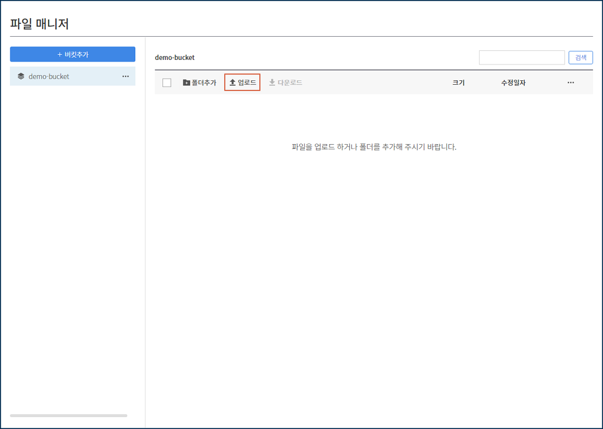

# 오브젝트 스토리지 사용 방법

## 1. 오브젝트 스토리지란?

카페24 클라우드의 오브젝트 스토리지는 인터넷을 통하여 언제 어디서나 대용량의 데이터를 저장하고 사용할 수 있는 저장소 서비스입니다.

웹 기반 콘솔, REST API 등 다양한 방법으로 파일을 저장하고, 저장된 파일은 파일마다 고유한 접근 URL이 부여되어 인터넷 상에서 여러 사용자가 쉽게 접근할 수 있습니다.

서로 다른 하드웨어에 파일을 분산, 중복으로 저장하여 높은 데이터 안정성을 보장합니다.

### (1) 오브젝트 스토리지 용도

① 음악, 사진, 비디오, 문서 파일 등의 비정형 데이터 업로드

② 서버의 데이터 백업

③ 대용량의 데이터 저장

④ HTTPS를 지원하며, 데이터가 암호화되어 안정성 제공

⑤ REST API를 지원하며, 파일 관리의 편리성 제공

⑥ Amazon S3 인터페이스와의 호환성 제공

### (2) 오브젝트 스토리지 특성

① **고가용성의 데이터 스토리지**

데이터를 분산 및 복제 후 저장하여 높은 데이터의 안정성을 보장합니다.

② **HTTPS 지원**

HTTPS 프로토콜을 지원하여 암호화된 데이터를 저장 및 다운로드 할 수 있습니다.

브라우저와 데이터가 저장된 오브젝트 스토리지 간에 암호화된 연결을 하여 민감한 정보의 보안성을 높입니다.&#x20;

③ **편리한 UI 및 다양한 이용 방법 제공**

카페24 클라우드 콘솔의 파일 매니저를 이용하여 오브젝트 스토리지를 직관적으로 사용할 수 있습니다.

### (3) 오브젝트 스토리지 사용 방법

① 카페24 클라우드 콘솔의 파일 매니저

② S3 Browser

③ CLI(Command Line Interface)

## 2. 오브젝트 스토리지 신청하기

<mark style="background-color:blue;">콘솔 > 스토리지 > 오브젝트 스토리지</mark>

API Endpoint(kr.cafe24obs.com)을 선택한 후, \[오브젝트 스토리지 신청] 버튼을 클릭합니다.

<figure><figcaption></figcaption></figure>

API를 통해 오브젝트 스토리지를 사용하기 위해서 API 키를 생성합니다.

S3 Browser 또는 S3cmd를 통해 API Endpoint 및 Access Key와 Secret Key을 이용하여 원격으로 파일 업로드/다운로드가 가능합니다.

S3cmd를 활용하여 오브젝트 스토리지를 사용하는 방법은 [<mark style="color:blue;">\[오브젝트 스토리지 S3cmd 사용 방법\]</mark>](s3cmd.md)을 참고해 주세요.

<figure><figcaption></figcaption></figure>

<figure><figcaption></figcaption></figure>

Secret Key를 확인하려면 \[보기] 버튼을 클릭한 후, 클라우드 계정 패스워드를 입력하시면 확인할 수 있습니다.

<figure><figcaption></figcaption></figure>

## 3. 파일 매니저 사용하기

오브젝트 스토리지 기능에서 파일 매니저의 \[관리] 버튼을 클릭하여 파일 매니저를 사용할 수 있습니다.

<figure><figcaption></figcaption></figure>

### (1) 버킷 생성하기

파일 매니저에서 \[버킷추가] 버튼을 클릭합니다.

<figure><figcaption></figcaption></figure>

버킷 이름과 버킷 공개여부를 설정합니다. 버킷 공개 권한 설정은 언제든지 변경할 수 있습니다.

<figure><figcaption></figcaption></figure>

생성된 버킷 이름의 오른쪽 상세 메뉴 클릭하면, 버킷 정보 확인 및 삭제와 권한 설정이 가능합니다.

<mark style="color:red;">단, 삭제한 버킷은 복구가 불가능합니다.</mark>

<figure><figcaption></figcaption></figure>

### (2) 파일 업로드하기

파일을 업로드할 버킷을 선택한 후, \[업로드] 버튼을 클릭합니다.

<figure><figcaption></figcaption></figure>

파일 업로드하기 창에서 업로드할 파일을 드래그하거나 해당 영역을 클릭하여 파일을 업로드합니다.

<figure><figcaption></figcaption></figure>

파일 매니저의 <mark style="color:blue;">파일 업로드 정책</mark>은 다음과 같습니다.

① **제한 용량**

* 업로드 가능한 개별 파일의 용량은 최대 20MB이며, 총 용량은 최대 400MB입니다.
* 한 번에 최대 20개의 파일을 업로드할 수 있습니다.
* 베타 서비스 기간 동안 무료로제공하는 최대 저장 공간은 30GB입니다.

② **전송 오류**

* 10분의 타임아웃 시간이 있습니다. 따라서 10분이 지날 경우, "파일 전송 시간 제한을 초과하였습니다." 오류가 발생합니다.

### (3) 폴더 생성하기

폴더를 생성할 버킷을 선택한 후, \[폴더추가] 버튼을 클릭합니다.

<figure><figcaption></figcaption></figure>

폴더 추가 창에서 폴더 이름을 입력합니다. 폴더 생성 후에는 이름 변경이 불가합니다.

<figure><figcaption></figcaption></figure>

### (4) 파일명 변경하기

변경할 파일의 오른쪽 상세 메뉴를 클릭한 후, \[이름바꾸기]를 선택하여 파일명을 변경할 수 있습니다.

<figure><figcaption></figcaption></figure>

### (5) 메타데이터 편집하기

메타데이터를 편집할 파일을 선택한 후, 메타데이터 정보의 \[편집] 버튼을 클릭합니다.

<figure><figcaption></figcaption></figure>

메타데이터 편집 창에서 키워드 및 값을 추가하거나 수정할 수 있습니다.

<figure><figcaption></figcaption></figure>

### (6) 파일 권한 확인하기

#### a. 파일 권한이 비공개인 경우

해당 파일의 링크 주소를 복사하여 웹 브라우저에서 접속을 시도합니다.

<figure><figcaption></figcaption></figure>

AccessDenied Error가 발생하며, 정상적인 페이지를 볼 수 없습니다.

<figure><figcaption></figcaption></figure>

#### b. 파일 권한이 공개인 경우

해당 파일의 링크 주소를 복사하여 웹 브라우저에서 접속을 시도합니다.

<figure><figcaption></figcaption></figure>

정상적으로 파일을 확인할 수 있습니다.

<figure><figcaption></figcaption></figure>

## 4. 오브젝트 스토리지 모니터링하기

상세 정보에서 금월 누적 트래픽 사용량과 사용 용량을 확인할 수 있습니다.

<figure><figcaption></figcaption></figure>

사용량 모니터링의 \[보기] 버튼을 클릭하면, 오브젝트 스토리지의 사용 용량을 5분 단위로 기간을 조정하여 확인할 수 있습니다.

<figure><figcaption></figcaption></figure>

마찬가지로 트래픽 모니터링의 \[보기] 버튼을 클릭하면, 오브젝트 스토리지에서 발생한 트래픽을 5분 단위로 기간을 조정하여 확인할 수 있습니다.

<figure><figcaption></figcaption></figure>
